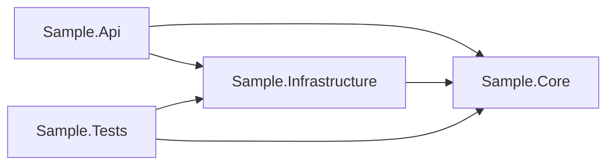

# Architecture

This repository uses a deliberately small .NET solution so the workflow design remains the focus.

```text
Sample.Api
  depends on Sample.Core and Sample.Infrastructure

Sample.Infrastructure
  depends on Sample.Core

Sample.Core
  no project dependencies

Sample.Tests
  validates Core and Infrastructure behavior
```

## Projects

`Sample.Api` is a minimal ASP.NET Core API. It exposes health, release-readiness, and promotion-decision endpoints with generic sample data.

`Sample.Core` contains business-neutral release concepts such as artifact metadata, version formatting, and promotion policy evaluation.

`Sample.Infrastructure` provides an in-memory release readiness reader. It is intentionally generic and does not represent a real database, service, server, or enterprise system.

`Sample.Tests` verifies versioning, promotion policy behavior, and the public-safe release readiness snapshot.

## Dependency Direction

The dependency direction keeps policy logic in Core and keeps replaceable implementation details in Infrastructure. This mirrors common .NET layering without exposing real architecture.



## Public-Safe Boundaries

The sample intentionally avoids real environment names beyond generic promotion stages. It does not include credentials, endpoints, server names, database names, internal repository names, or real deployment logic.
